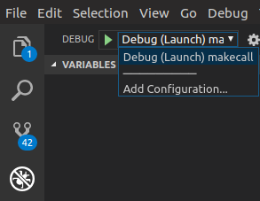

# webdialer-java-sample

## Overview

Sample Java program demonstrating usage of the Cisco WebDialer SOAP API and Axis2 to perform a `<makeCallSoap>` call, wait 5 seconds, then end the call with `<endCallSoap>`.

Visit the [DevNet WebDialer Site](https://developer.cisco.com/site/webdialer)

## Requirements

- Java 1.8
- Apache [Axis 1.4](http://www.apache.org/dyn/closer.cgi/ws/axis/1_4) / [Axis 2](http://axis.apache.org/axis2/java/core/download.cgi) libraries
- A working Cisco Unified Communications Manager environment:
    - An application-user username/password, with ''Standard EM Authentication Proxy Rights' role
    - An end-user username/password
    - A CTI controllable phone device (such as a Jabber PC client) configured with at least one line, associated to the end-user
    - Ideally a destination phone number for testing (though you could have the line call its own number)

## Getting started

1. Make sure you have Oracle Java SE 1.8 installed, and `java` is available in the path

    ```bash
    $ java -version
    java version "1.8.0_201"
    Java(TM) SE Runtime Environment (build 1.8.0_201-b09)
    Java HotSpot(TM) 64-Bit Server VM (build 25.201-b09, mixed mode)
    ```

1. Open a terminal and use `git` to clone this repository:

    ```bash
    git clone https://github.com/CiscoDevNet/webdialer-java-sample.git
    ```

1. Open the Java project in [Visual Studio Code](https://code.visualstudio.com/):

    ```bash
    cd webdialer-java-sample
    code .
    ```

1. Download the CUCM Tomcat HTTPS certificate (format: x.509 with chain (PEM) ), and place in the `certificate/` folder
  
1. Import the CUCM HTTPS certificate into the local Java keystore.

    The following command wastested on Ubuntu Linux 19.04, see the Oracle Java documentation for more info on managing Java certificates. Be sure to replace `{ANYNAME}` and `{CERTFILE}` with your particular values

    ```bash
    sudo $JAVA_HOME/bin/keytool -import -alias {ANYNAME} -file certificate/{CERTFILE} -keystore  $JAVA_HOME/jre/lib/security/cacerts
    ```

1. Edit `.vscode/launch.json` to specify environment variables for your CUCM location, WebDialer proxy user credentials, targer user name, calling device name, and to/from phone numbers

1. The 11.5 version of the WebDialer WSDL file is included in this proect.  If  you want to use a different version, download the WebDialer WSDL files for your CUCM version, and place in `schema/`:

    ```bash
    https://{cucm}:8443/webdialer/wsdl/wd70.wsdl
    ```

1. Import the WebDialer WSDL and generate the Axis2 `.java` files:

    ```bash
    java -cp "lib/*" org.apache.axis.wsdl.WSDL2Java -o src/ schema/wd70.wsdl
    ```

1. Finally, to launch the sample in VS Code, select the **Debug** panel, the choose `Debug (Launch) makecall` launch option, and click the green 'Start Debugging' arrow:

    

## Notes

- JAX/WS does not support the "rpc/encoded" SOAP style of the WebDialer WSDL, so Apache Axis was used

- Elements of Axis 1.4 and Axis 2 were needed to make the project work.  The `lib/` folder in this project contains all the .jars from Axis 1.4 plus the following .jars from Axis 2:

    - `activation-1.1.jar`
    - `mail-1.4.jar`

- **Adding Axis .jars to the VS Code build classpath** - as of this writing, this is done by manually editing the `.classpath` file and creating `<classpathentry king="lib" path="...">` elements for each target .jar
